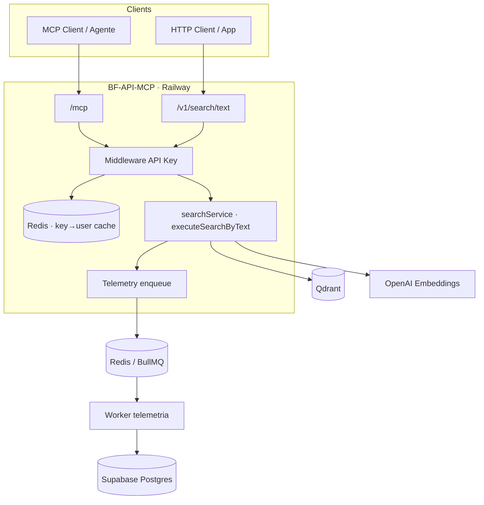

# Plano: BuscaFornecedor API+MCP seguro e escalável

Versão atual = **núcleo de busca** (REST `/search/text` + MCP `/mcp` + X-Ray chat).  
Stub de auth em `src/middleware/auth.js`.  
Este documento planeja a evolução para multi-tenant com API key, registro de buscas no Supabase e hot path sem bloqueio.

**Definition of Done (produto):** ver [`aceitacao.md`](aceitacao.md).

---

## 1. Objetivos

1. Autenticar cada chamada (REST e MCP) com **API key** ligada a usuário/org na plataforma.
2. Responder a busca com latência ≈ Qdrant + OpenAI (sem esperar Postgres).
3. **Registrar buscas** no Supabase de forma assíncrona (histórico, cotas, partições).
4. Manter um único pipeline de busca compartilhado por REST e MCP.

---

## 2. Arquitetura alvo



### Hot path (usuário espera)

1. Validar API key (cache Redis / memória TTL).
2. Checagem leve de cota (contador Redis).
3. Gerar `search_id` (UUID).
4. `executeSearchByText` → OpenAI + Qdrant.
5. Responder `200` com `results` + `search_id`.
6. Enfileirar evento `search.completed` (fire-and-forget).

### Cold path (assíncrono)

Worker consome a fila e grava no Supabase:

- `searches` (query, params, latência, `source: rest|mcp`, `user_id`, `org_id`, `api_key_id`)
- `usage_events` / contadores de cota
- Partições por mês (`created_at`) ou por `org_id`

Falha no worker **não** afeta a resposta já enviada ao cliente.

---

## 3. Modelo de dados (Supabase) — fase 1

```sql
-- organizações / planos
organizations (id, name, plan, created_at)

-- perfil plataforma
profiles (id uuid PK = auth.users, org_id, display_name)

-- API keys: guardar só hash
api_keys (
  id uuid PK,
  org_id uuid,
  user_id uuid,
  key_prefix text,      -- sk_live_abcd
  key_hash text unique, -- sha256
  name text,
  active boolean default true,
  created_at, revoked_at
)

-- buscas (particionar por created_at mensal na fase 2)
searches (
  id uuid PK,           -- mesmo search_id da API
  org_id, user_id, api_key_id,
  source text,          -- rest | mcp
  query text,
  params jsonb,         -- weights, queries, filter, bm25_query...
  result_count int,
  latency_ms int,
  embedding_dims int,
  status text,          -- completed | error
  error_message text,
  created_at timestamptz default now()
)

usage_daily (
  org_id, day date,
  search_count int,
  primary key (org_id, day)
)
```

---

## 4. Fases de implementação

### Fase 0 — ✅ Núcleo (esta pasta)

- [x] `POST /search/text`, `GET /config`, `GET /health`
- [x] MCP Streamable HTTP (`search_text`, `get_config`)
- [x] Query Manager + chat X-Ray + filtro regional (API cidades → `filter.cidade`)
- [x] `search_id` / request id no hot path
- [x] Sem Postgres no hot path (telemetria ainda planejada)

### Fase 1 — Auth por API key

- [x] Middleware `AUTH_MODE=api_key` (Bearer / X-Api-Key) em REST e MCP — lookup em env
- [ ] Tabela `api_keys` + script de emissão (`sk_live_…` mostrado 1x)
- [ ] Cache in-memory/Redis: `hash → { user_id, org_id, plan }` TTL 60–300s
- [ ] Ligar key → `user_id` / org reais (Supabase) — Subtarefa 2.4 / [`aceitacao.md`](aceitacao.md)

### Fase 2 — Telemetria assíncrona

- [x] Gerar `search_id` no início da request
- [ ] Publisher Redis/BullMQ: `search.started` + `search.completed`
- [ ] Worker separado (serviço Railway) escreve em `searches` / `consultas`
- [ ] Idempotência por `search_id`
- [ ] Métrica: lag da fila + taxa de falha de persistência

### Fase 3 — Cotas e planos

- [ ] Contador Redis `usage:{org_id}:{yyyy-mm-dd}`
- [ ] Soft limit síncrono (429 se estourar)
- [ ] Worker reconcilia `usage_daily` no Postgres
- [ ] Dashboard interno (opcional) por org

### Fase 4 — Partições e retenção

- [ ] Particionar `searches` por mês
- [ ] Job de retenção (ex.: 90/180 dias conforme plano)
- [ ] Índices: `(org_id, created_at)`, `(user_id, created_at)`

### Fase 5 — Hardening

- [ ] Rate limit por key (token bucket Redis)
- [ ] Rotação de keys + audit log
- [ ] Auth no MCP (Bearer) alinhada ao REST
- [ ] OpenTelemetry / logs estruturados com `search_id`, `org_id`
- [ ] Multi-instância: sticky não necessário no Streamable HTTP se sessões forem curtas; workers escalam horizontalmente

---

## 5. Contrato de eventos da fila

```json
{
  "type": "search.completed",
  "search_id": "uuid",
  "org_id": "uuid",
  "user_id": "uuid",
  "api_key_id": "uuid",
  "source": "mcp",
  "query": "...",
  "params": { "weights": {}, "queries": {}, "filter": {}, "bm25_query": "..." },
  "result_count": 10,
  "latency_ms": 820,
  "embedding_dims": 1536,
  "status": "completed",
  "ts": "2026-07-24T18:00:00.000Z"
}
```

---

## 6. Estrutura de pastas futura

```
src/
  server.js
  http/routes/search.js
  mcp/
  auth/apiKey.js
  search/searchService.js      # atual
  telemetry/enqueue.js
  telemetry/events.js
worker/
  index.js                     # consome fila → Supabase
```

Deploy Railway sugerido:

| Serviço | Comando | Env |
|---------|---------|-----|
| `api` | `npm start` | Qdrant, OpenAI, Redis, `SUPABASE_URL` (só leitura de keys) |
| `worker` | `node worker/index.js` | Redis, `DATABASE_URL` / Supabase service role |

---

## 7. Princípios (não negociar)

1. **Hot path nunca espera Supabase write.**
2. REST e MCP passam pelo **mesmo** `executeSearchByText` + mesmo enqueue.
3. Segredo da API key **nunca** em log; só prefixo + hash.
4. Telemetria com **pelo menos uma vez** (at-least-once) + idempotência.
5. Evoluir por fases sem quebrar o contrato público de `/search/text` e tools MCP.

---

## 8. Próximo passo concreto

Implementar **Fase 1** neste repositório:

1. Schema SQL + migration Supabase  
2. `src/auth/apiKey.js` + wiring no Express e no MCP  
3. Variáveis `SUPABASE_URL` / `SUPABASE_SERVICE_ROLE` (lookup de keys)  
4. Testes: request sem key → 401; com key válida → busca OK
