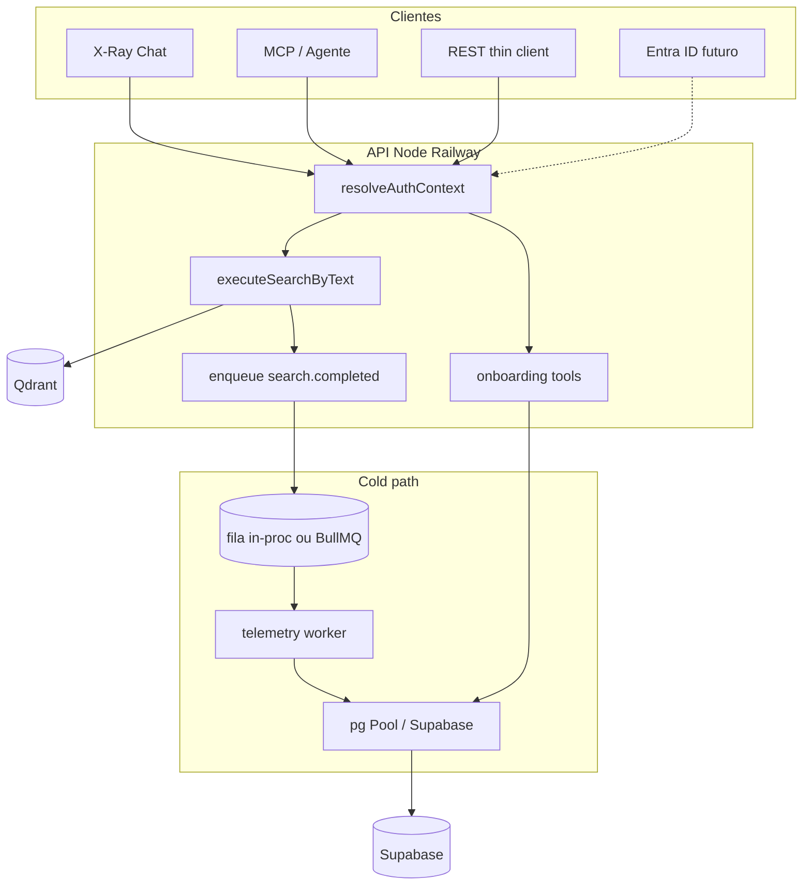

# Plano de implementação — Auth + Supabase (identidade, histórico, aparições)

**Objetivo:** fechar os critérios de aceite 2, 5 e 6 ([`aceitacao.md`](aceitacao.md)) ligando a API+MCP+X-Ray ao projeto Supabase **abcAdvise**, de forma **assíncrona**, **escalável** e **compatível com Microsoft Entra ID**.

**Status:** planejamento aprovado para implementação por fases.  
**Não contém secrets.**

---

## 1. Problema e escopo

| Critério | O que falta hoje |
|----------|------------------|
| 2.4 Identificar usuário | `userId` sempre `null`; auth local sem vínculo a `auth.users` |
| Histórico Supabase | Qdrant ok; nenhum insert em `consultas` |
| Contador de Aparições | Sem tabela/código de CNPJ → exibições |

**Incluído neste plano**

- Modelo de identidade Entra-ready + API key de agente ligada ao comprador
- Onboarding conversacional (X-Ray) → conta comprador + chave
- Persistência async de `consultas` + aparições + incremento de cotas
- Pool de conexões / client Supabase seguro
- Skill de agente Cursor para operações DB/Supabase

**Fora de escopo (agora)**

- Fallback Vector (critério 7)
- Módulo de Envios SMS/e-mail (critério 8)
- Trocar hot path sync por fila de *execução* de busca (GUIA/RabbitMQ) — mantém-se ADR 003

---

## 2. Princípios arquiteturais

1. **Hot path sync** (ADR 003): Auth leve → embed → Qdrant → resposta. **Não await** writes de histórico/aparições.
2. **Cold path async** (ADR 006): após `res.json` / retorno MCP, enfileirar evento `search.completed`.
3. **Identidade canônica** = `auth.users.id` (UUID). Todo comprador = row em `busca_fornecedor.usuario_comprador`.
4. **Credenciais pluggáveis** no mesmo `req.auth` (REST, MCP, X-Ray).
5. **Service role só no servidor**; nunca no thin client / MCP browser.
6. **Compat Entra ID:** OIDC claims → mesmo `userId`; API keys para agentes sem browser SSO.
7. **Schema real primeiro:** preferir `consultas` + `usuario_comprador`; criar só o que faltar (`api_keys`, `aparicoes`).



---

## 3. Modelo de autenticação (Entra-ready)

### 3.1 Camadas de credencial

| Modo | Header | Uso | Resolve |
|------|--------|-----|---------|
| `off` | — | Dev local | anônimo (sem busca “de produto” se `REQUIRE_COMPRADOR=1`) |
| `api_key` | `Bearer sk_…` ou `X-Api-Key` | Agente / thin client / MCP | hash → `api_keys.user_id` → comprador |
| `supabase_jwt` | `Bearer <access_token>` | App / chat com sessão Auth | JWT `sub` → comprador |
| `entra_oidc` *(fase futura)* | `Bearer <Entra access_token>` | Copilot / Microsoft proxy | validar JWKS Entra → mapear `oid`/`sub` → `auth.users` |

`AUTH_MODE` pode ser lista: `api_key,supabase_jwt` (tentar na ordem: JWT reconhecível → senão API key).

### 3.2 Shape estável de `req.auth`

```ts
{
  authenticated: boolean,
  userId: string | null,          // auth.users.id
  apiKeyId: string | null,        // api_keys.id
  orgId: null,                    // reservado
  keyPrefix: string | null,       // sk_live_ab… (nunca key completa)
  provider: "anonymous" | "api_key" | "supabase" | "entra",
  roles: ("comprador" | "fornecedor" | "admin")[],
  comprador: {
    nome: string | null,
    tierBusca: string,
    limiteBuscas: number,
    buscasRealizadas: number,
  } | null
}
```

### 3.3 Compatibilidade Microsoft Entra ID

Desenho **agora** para não quebrar depois:

1. Não acoplar regra de negócio ao “tipo de token” — só a `userId` + roles.
2. Guardar em `auth.users.raw_app_meta_data` (ou tabela `identities_map`):
   - `entra_oid`, `entra_tid` (tenant), `issuer`
3. Fase futura: Supabase Auth **SSO / OIDC** com Entra **ou** validação JWKS direta (`AUTH_ENTRA_TENANT_ID`, `AUTH_ENTRA_AUDIENCE`) + upsert user.
4. Agentes Microsoft Copilot/MCP continuam usando **API key** do comprador (sem SSO interativo), emitida na conversa ou no portal.

### 3.4 API keys (migration nova)

Tabela `busca_fornecedor.api_keys`:

| Coluna | Tipo | Notas |
|--------|------|--------|
| `id` | uuid PK | |
| `user_id` | uuid FK → `auth.users` | dono = comprador |
| `name` | text | ex. "X-Ray", "Copilot" |
| `key_prefix` | text | `sk_live_abcd` |
| `key_hash` | text UNIQUE | SHA-256 (ou Argon2id) |
| `scopes` | text[] | default `{search}` |
| `active` | bool | |
| `last_used_at` | timestamptz | |
| `expires_at` | timestamptz null | |
| `created_at` | timestamptz | |
| `revoked_at` | timestamptz null | |

- Key plaintext mostrada **uma vez** na emissão.
- Cache in-memory/Redis: `key_hash → AuthContext` TTL 60–300s.
- Nunca logar key completa.

### 3.5 Gate de produto

- Busca de produção exige `roles` contendo `comprador` (perfil em `usuario_comprador`).
- Sem perfil: agente **não** executa `search_suppliers`; inicia onboarding.
- Soft quota: se `buscas_realizadas >= limite_buscas` → `403` / mensagem conversacional (incremento async).

---

## 4. Onboarding via agente (X-Ray / tools)

### 4.1 Fluxo conversacional

```mermaid
sequenceDiagram
  participant U as Usuario
  participant A as AgenteXRay
  participant API as API
  participant SB as Supabase

  U->>A: Quero buscar embalagens
  A->>A: Sem session auth / sem comprador
  A->>U: Para alocar a busca, preciso criar seu perfil comprador
  U->>A: nome, email, telefone, empresa
  A->>API: register_buyer
  API->>SB: auth.admin.createUser + usuario_comprador
  API->>SB: insert api_keys hash
  API-->>A: user_id + sk_live_… (1x)
  A->>U: Guarde sua chave; próximas mensagens usam essa identidade
  U->>A: Continuar busca…
  A->>API: search_suppliers Authorization key
  API->>API: hot path Qdrant
  API-->>A: results
  API--)SB: async consultas + aparicoes
```

### 4.2 Tools novas (MCP + X-Ray)

| Tool | Função |
|------|--------|
| `register_buyer` | Cria `auth.users` + `usuario_comprador` (`fonte=Agente` / `X-Ray`) |
| `issue_api_key` | Emite key para user autenticado (rota protegida) |
| `get_my_profile` | Retorna cotas / nome (sem PII extra) |
| `revoke_api_key` | Revoga por `key_prefix` / id |

REST espelho (opcional fase 1): `POST /auth/register-buyer`, `POST /auth/api-keys`.

### 4.3 Segurança do onboarding

- Rate limit por IP/session no register.
- E-mail único; telefone opcional.
- Confirmação de e-mail: fase 1 pode criar user `email_confirm: true` só em ambientes controlados; produção preferir magic link / OTP.
- A chave retornada na conversa: avisar para salvar; não reexibir depois.

---

## 5. Histórico de buscas → `consultas`

Reutilizar **`busca_fornecedor.consultas`** (já designada).

### 5.1 Mapeamento evento → colunas

| Campo `consultas` | Origem API |
|-------------------|------------|
| `id` | = `search_id` (UUID da request) — idempotência |
| `comprador` | `req.auth.userId` |
| `parametros` | jsonb: weights, queries, filter, filter_not, bm25, limits, geo, intent, origem |
| `resultados` | jsonb: lista resumida (id, cnpj, nome, score, posicao, cidade, uf) — **não** dump enorme de payload |
| `status` | `completed` / `error` |
| `session_id` | X-Ray `session_id` se houver |
| `execution_id` | `search_id` ou request id |
| `v_produto`…`v_publico`, `bm_25` | textos de `queries` / `bm25_query` |
| `uf` / `municipio` | arrays do filtro geo |
| `modelo_negocio` | filter |
| `fallback` | false (até critério 7) |
| `origem` | `api` \| `mcp` \| `xray` |
| `qualidade` | opcional (intent / tier) |

Também incrementar `usuario_comprador.buscas_realizadas` no mesmo worker (update atômico).

### 5.2 Payload de resultados

Limitar a ~`final_limit` itens com campos allowlist — evita jsonb gigante e vazamento de campos sensíveis.

---

## 6. Contador de Aparições

### 6.1 Migration nova: `busca_fornecedor.aparicoes`

| Coluna | Tipo | Notas |
|--------|------|--------|
| `id` | uuid PK | |
| `consulta_id` | uuid FK → `consultas(id)` | |
| `comprador_id` | uuid FK → `auth.users` | denormalizado p/ queries |
| `cnpj` | text | normalizado só dígitos |
| `nome_empresa` | text | |
| `posicao` | int | |
| `score_final` | numeric | |
| `cidade` / `uf` | text | |
| `origem` | text | api/mcp/xray |
| `created_at` | timestamptz | |

Índices: `(cnpj, created_at DESC)`, `(consulta_id)`, `(comprador_id, created_at DESC)`.

### 6.2 Agregado (opcional fase 1.1)

`busca_fornecedor.aparicoes_cnpj_agg (cnpj PK, total bigint, last_seen_at)`  
Worker: `INSERT … ON CONFLICT DO UPDATE SET total = total + 1`.

Se já existir contador em outra tabela do ecossistema, **adaptar** em vez de duplicar — skill Supabase manda inspecionar schema live antes.

---

## 7. Cold path assíncrono

### 7.1 Fase A (MVP — 1 instância Railway)

- Após responder: `setImmediate` / microfila in-process (`p-queue` concurrency 2–4).
- Writer usa **pg Pool** (Supabase **pooler** `6543` transaction mode) ou Supabase JS service role.
- Retry com backoff (3x); falha → log estruturado `telemetry_failed` (não afeta cliente).
- Idempotência: `INSERT … ON CONFLICT (id) DO NOTHING` em `consultas`.

### 7.2 Fase B (multi-instância)

- Redis + BullMQ (ADR 006): job `search.completed`.
- Worker processo separado (`worker/telemetry.js`) no Railway.
- DLQ / métrica de lag.

### 7.3 Contrato do evento

```json
{
  "type": "search.completed",
  "search_id": "uuid",
  "user_id": "uuid",
  "source": "rest|mcp|xray",
  "session_id": "uuid|null",
  "params": {},
  "results_summary": [],
  "latency_ms": 123,
  "status": "completed",
  "occurred_at": "ISO-8601"
}
```

Enqueue **fire-and-forget** a partir de REST, MCP e X-Ray (mesmo helper).

---

## 8. Camada de dados (pool e segurança)

### 8.1 Módulos sugeridos

```
src/db/
  supabaseAdmin.js     # createClient service role (Auth Admin + PostgREST)
  pgPool.js            # pg.Pool via DATABASE_URL (pooler)
  repositories/
    compradorRepo.js
    apiKeysRepo.js
    consultasRepo.js
    aparicoesRepo.js
src/auth/
  resolveAuth.js       # jwt + api_key + futuro entra
  registerBuyer.js
  issueApiKey.js
  jwtSupabase.js
  apiKeyHash.js
src/telemetry/
  events.js
  enqueue.js
  writers.js           # usado in-proc ou worker
```

### 8.2 Pool

| Uso | Client |
|-----|--------|
| Auth Admin (`createUser`, `getUser`) | `@supabase/supabase-js` service role |
| Writes de alto volume (`consultas`, `aparicoes`) | `pg` Pool → **Supabase connection pooler** |
| Lookups de auth com cache | PostgREST ou SQL curto + cache memória |

Env:

```env
SUPABASE_URL=
SUPABASE_ANON_KEY=          # só se necessário client pattern
SUPABASE_SERVICE_ROLE_KEY=  # só servidor
DATABASE_URL=               # postgres://…@…pooler.supabase.com:6543/postgres
AUTH_MODE=api_key,supabase_jwt
REQUIRE_COMPRADOR=1
TELEMETRY_MODE=inline|bullmq
```

### 8.3 Regras de segurança

- Nunca commit keys; Railway secrets.
- Logs: `user_id`, `key_prefix`, `search_id` — **sem** token/key/email completo em nível info (email só em debug mascarado).
- Repositórios recebem `userId` explícito; service role não vira “bypass sem filtro”.
- RLS: políticas para paths client; backend service role documentado.
- Redação de `resultados` jsonb (allowlist de campos).

---

## 9. Fases de implementação

### Fase S0 — Fundações (1–2 dias)

- [ ] Deps: `@supabase/supabase-js`, `pg`
- [ ] `src/db/supabaseAdmin.js` + `pgPool.js`
- [ ] SQL migrations: `api_keys`, `aparicoes` (+ agg opcional)
- [ ] Extender `.env.example` + `docs/database.md`
- [ ] Skill `supabase-db` (este plano)

### Fase S1 — Identidade (Subtarefa 2.4)

- [ ] `AUTH_MODE` multi: `api_key` (hash Supabase) + `supabase_jwt`
- [ ] Cache de key → contexto
- [ ] `register_buyer` + `issue_api_key` (REST e tools X-Ray)
- [ ] Gate: busca exige comprador quando `REQUIRE_COMPRADOR=1`
- [ ] Agente: fluxo conversacional de cadastro antes da busca
- [ ] Testes unitários auth + integração register

### Fase S2 — Histórico async

- [ ] `enqueueSearchCompleted` no hot path (REST/MCP/X-Ray)
- [ ] Writer → `consultas` + `buscas_realizadas++`
- [ ] Idempotência por `search_id`
- [ ] Modo `TELEMETRY_MODE=inline` primeiro

### Fase S3 — Aparições

- [ ] Writer grava N rows em `aparicoes` por resultado
- [ ] Upsert agg `aparicoes_cnpj_agg`
- [ ] Probe/admin read-only opcional (contagem por CNPJ)

### Fase S4 — Endurecimento Entra + escala

- [ ] Stub `entra_oidc` (JWKS + map `oid`→user) ou SSO Supabase
- [ ] `TELEMETRY_MODE=bullmq` + worker Railway
- [ ] Rate limit register/search por user
- [ ] Atualizar [`aceitacao.md`](aceitacao.md) marcando critérios 2, 5, 6

---

## 10. Critérios de pronto (por fase)

**S1:** chamada autenticada com key/JWT preenche `req.auth.userId`; agente cria comprador e emite key; busca sem perfil é bloqueada com mensagem clara.

**S2:** após busca autenticada, row em `consultas` com params + resultados resumidos; cota incrementada; latência p95 da busca ≈ igual à atual (± overhead enqueue).

**S3:** cada CNPJ retornado gera aparição; agg incrementa; consultável por CNPJ.

**S4:** documentação Entra; worker separado; DoD 2/5/6 `[x]` em `aceitacao.md`.

---

## 11. Riscos e mitigações

| Risco | Mitigação |
|-------|-----------|
| Service role abuso | Repos com `userId` obrigatório; audit logs |
| Vazamento de key no chat | Aviso UX; rotação/revoke; prefixo só em logs |
| Pool exhaustion | Pooler 6543; max connections baixos; timeout |
| Evento perdido (inline crash) | Fase B BullMQ; métrica `telemetry_failed` |
| Schema `consultas` diverge | Skill manda introspectar colunas live antes do writer |
| Duplo incremento cota | Idempotência + update só se insert consulta ok |

---

## 12. Referências

- [`supabase-users.md`](supabase-users.md) — schema live
- [`aceitacao.md`](aceitacao.md) — DoD
- [`PLANO_ESCALAVEL.md`](PLANO_ESCALAVEL.md) — fases auth/telemetria
- [`workers.md`](workers.md)
- ADR 005 (api key), 006 (telemetria), 009 (JWT Supabase), **010** (híbrido Entra-ready)
- Skill: `.cursor/skills/supabase-db/SKILL.md`
